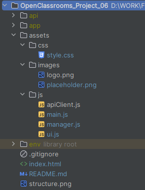
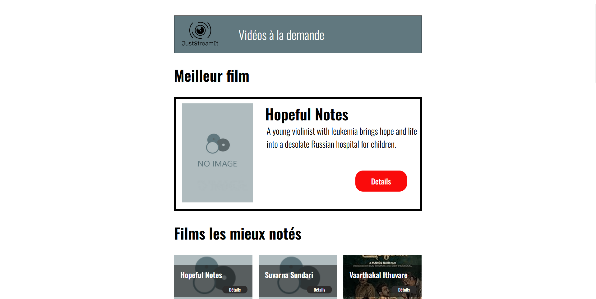
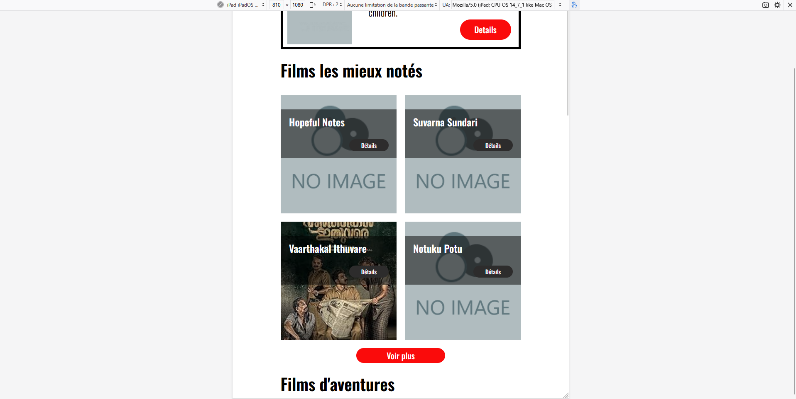
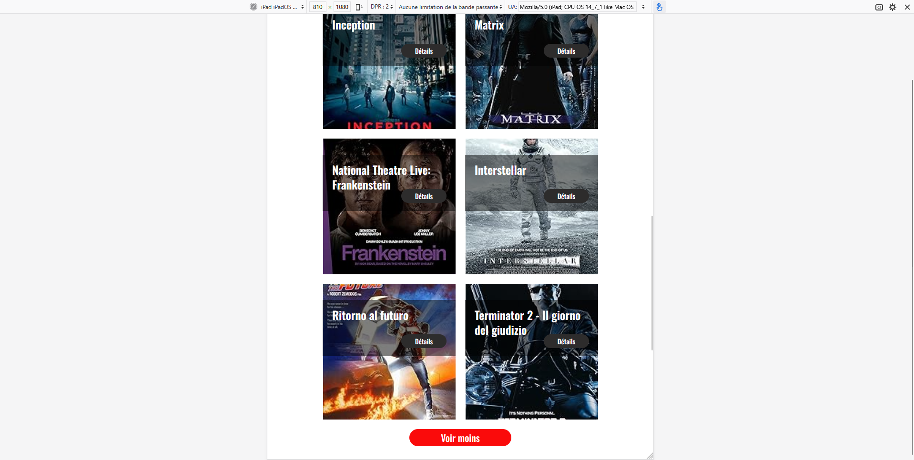
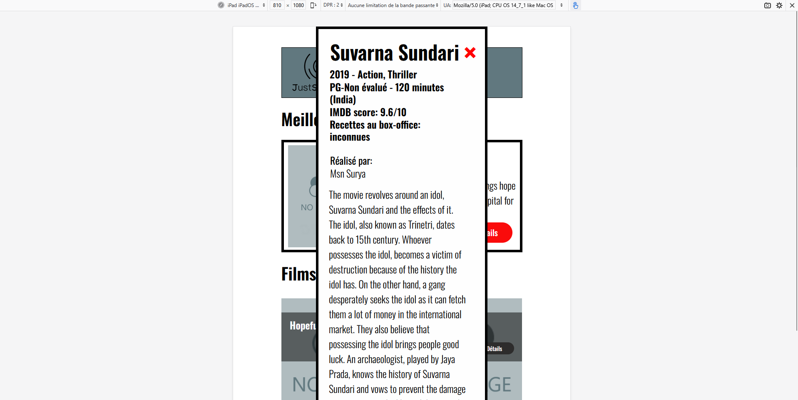
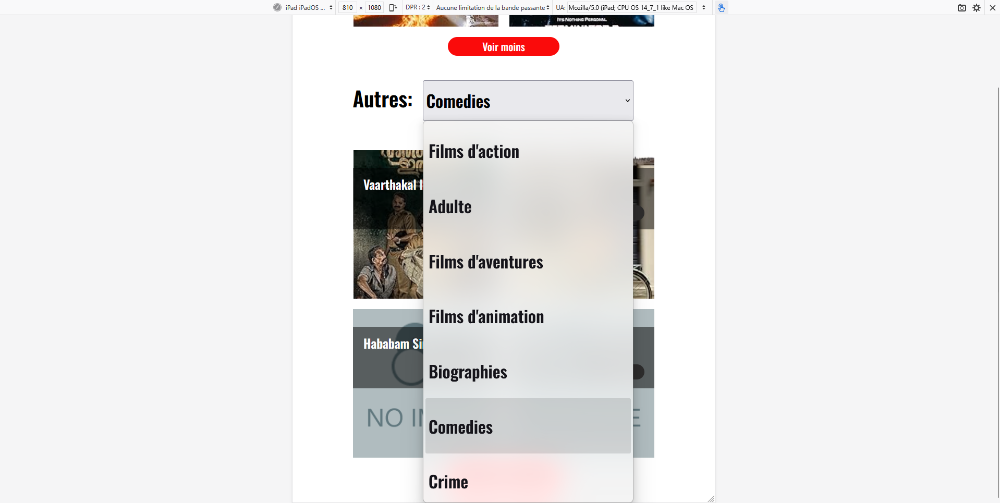
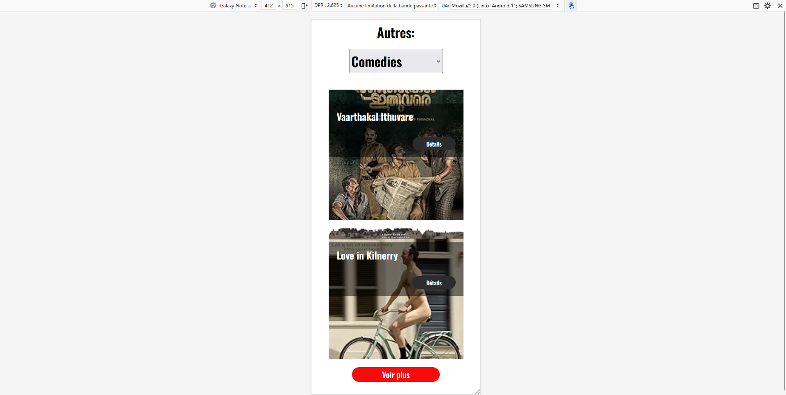
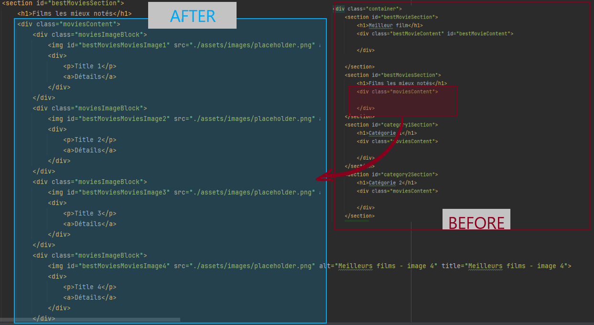

## WEB APP - OpenClassrooms Project 06
**Develop a user interface for a Python web application**

---

## DESCRIPTION

This project was completed as part of the "Python Developer" path at OpenClassrooms.

The goal was to develop the front-end interface of a Python web application capable of:
- Visualizing a real-time ranking of interesting films.
- Getting datas form 'OCMovies-API' API Rest
- Displaying UI accordingly to the graphic design from Figma

---

## PROJECT STRUCTURE
<p align="center">

</p>

---

### USAGE

#### Launch in local the API Rest server and Open the HTML page in your browser
`index.html`

---

### EXAMPLES

<p align="center">
    
    
    
    
    
    
    
    
    
    
    
    
</p>

---

### MAIN FEATURES

- Dynamic movie loading with `createElement()`
- Sorting by category (+ best movie)
- Image caching and preloading
- "See more / See less" responsive system
- User-friendly modal management
- Clean, modular code → clear architecture

---

### EXPLANATIONS OF WHAT THE FRONT-END DOES

#### <u>Dynamic loading</u>

The JS part loads the movies dataset dynamically into the HTML page. Indeed, the 'moviesContent' sections are 
generated dynamically as shown in the screenshots below. You will see appear the 'moviesImageBlock' balises after html 
generation :



#### <u>Smart images management</u>

```const imageCache = new Map();

async function createImage(movie, target) {
  const placeholder = "./assets/images/placeholder.png";
  const img = document.createElement("img");
  img.alt = `${movie.title} - image ${target}`;

  const url = movie?.imageUrl;

  if (imageCache.has(url)) {
    img.src = imageCache.get(url) ? url : placeholder;
    return img;
  }

  try {
    await preload(url);
    imageCache.set(url, true);
    img.src = url;
  } catch {
    imageCache.set(url, false);
    img.src = placeholder;
  }
  return img;
} 
```

#### <u>Responsive design (mobile-first) with breakpoints</u>

```
/* Mobile */
@media (max-width: 480px) { ... }

/* Tablet */
@media (min-width: 481px) and (max-width: 1024px) { ... }

/* Desktop */
@media (min-width: 1025px) { ... }
```

The display is adapted automatically with css as below. 
- 2 movies by category : mobile
- 4 movies by category : tablet
- 6 movies by category : desktop

---

### PROPOSED IMPROVEMENTS

- Local storage (local API cache)
- Possible migration to React/Vue
- Unit testing (Jest or Pytest API-side)
- Optimized loading (lazy loading)

---


---

## AUTHOR
**Name**: Nicolas MARIE  
**Track**: Python Developer – OpenClassrooms  
**Project – Develop the user interface of a web app : OCMovies – November 2025**
