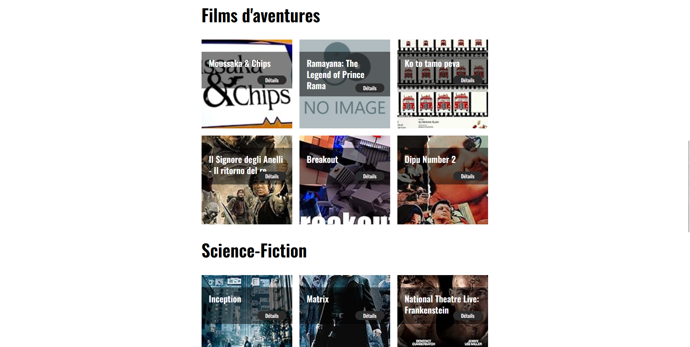
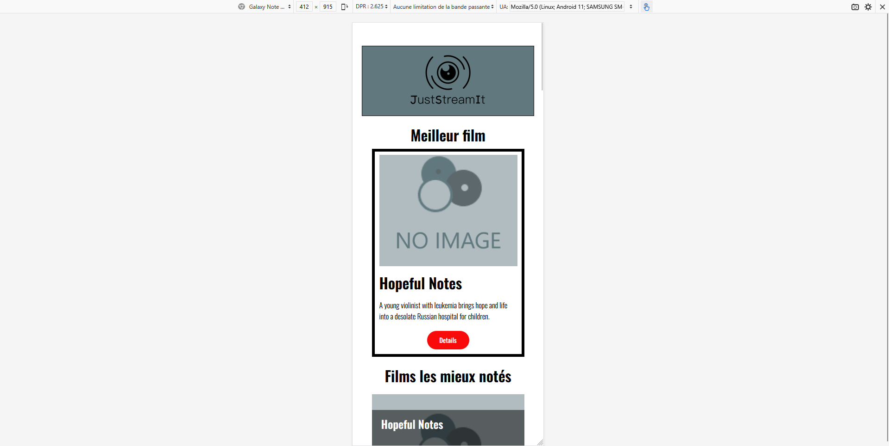
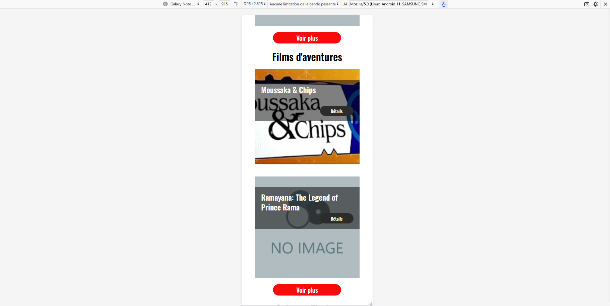
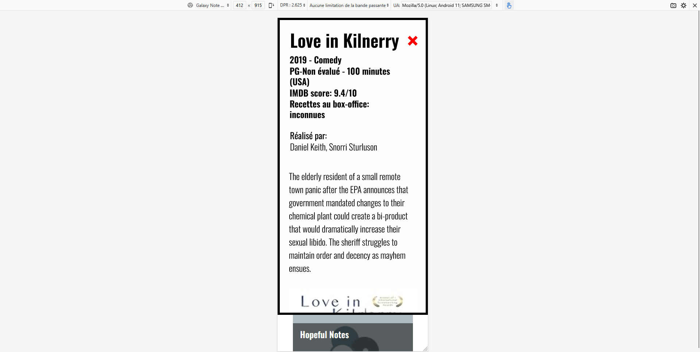
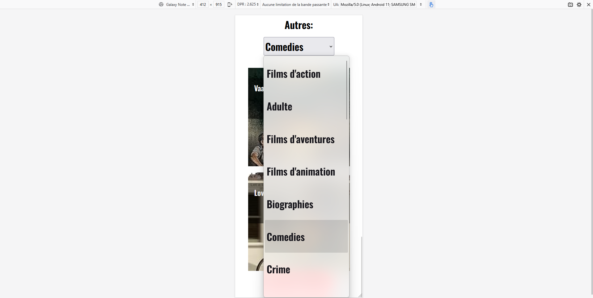

## WEB APP - OpenClassrooms Project 06
**Develop a user interface for a Python web application**

## DESCRIPTION

This project was completed as part of the "Python Developer" path at OpenClassrooms.

The goal was to develop the front-end interface of a Python web application capable of:
- Visualizing a real-time ranking of interesting films.
- Getting datas form 'OCMovies-API' API Rest
- Displaying UI accordingly to the graphic design from Figma

## PROJECT STRUCTURE

### USAGE

#### Launch in local the API Rest server and Open the HTML page in your browser
`index.html`

### EXAMPLES

## AUTHOR
**Name**: Nicolas MARIE  
**Track**: Python Developer – OpenClassrooms  
**Project – Develop the user interface of a web app : OCMovies – November 2025**
